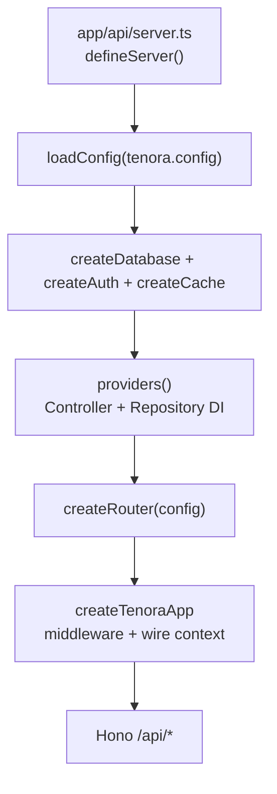

# Kiến trúc

## Monorepo

```text
app/api   ──depends──▶  @tenora/server
app/web   ──depends──▶  @tenora/client

app/web KHÔNG import @tenora/server
```

Hai app shell mỏng: framework logic nằm trong `packages/`, bạn chỉ mở rộng qua config + hooks (`createRouter`, `providers`).

## Luồng boot API



### `defineServer` — 3 hook do app cung cấp

| Hook | File app | Vai trò |
|------|----------|---------|
| `config` | `tenora.config.ts` | Cấu hình merge với defaults |
| `createRouter` | `routers/index.ts` | Route groups → Hono router |
| `providers` | `providers/index.ts` | Đăng ký controller + repository |

```ts
// app/api/server.ts
export default defineServer({ config, createRouter, providers: registerProviders });
```

## Runtime

| Import | Entry file | Deploy target |
|--------|------------|---------------|
| `@tenora/server/runtime/cloud` | `server.ts` | Wrangler, Vercel edge |
| `@tenora/server/runtime/node` | `server.node.ts` | Bun VPS / local |

Chi tiết: [Runtime](./api/runtime.md).

## Dependency injection

Không còn container infra chung. Chỉ 2 container domain:

| Container | Đăng ký trong | Resolve qua context |
|-----------|---------------|---------------------|
| `ControllerContainer` | `providers/index.ts` | `c.get('controllers')` |
| `RepositoryContainer` | `providers/index.ts` | `c.get('repositories')` |

Infra (`db`, `auth`, `cache`) được boot một lần và inject thẳng vào Hono context — không qua DI container.

Chi tiết: [Providers](./api/providers.md).

## Request context (`BackendEnv`)

Mỗi request có sẵn trên `c`:

| Key | Kiểu | Khi nào có |
|-----|------|------------|
| `db` | Drizzle DB | database enabled |
| `auth` | Better Auth | auth enabled |
| `cache` | Cache | cache enabled |
| `controllers` | ControllerContainer | luôn |
| `repositories` | RepositoryContainer | luôn |
| `userId` | string | sau auth middleware |
| `requestId`, `locale`, `timezone` | string | core middleware |

## Layer domain

```text
Route  →  Controller  →  Repository  →  Database (Drizzle)
```

- **Route**: `defineGroup` + `bindContainerController('UserController', 'index')`
- **Controller**: `extends BaseController` — HTTP, JSON, session helpers
- **Repository**: `extends BaseRepository` — truy vấn Drizzle

Không có Service layer mặc định — thêm khi app cần.

## Middleware pipeline

Thứ tự trong `createTenoraApp`:

1. CORS
2. Context defaults (requestId, locale, timezone)
3. Core (locale, timezone, request-id, security headers, auth session)
4. Rate limit (nếu bật)
5. CSRF (nếu bật)
6. Wire context (db, auth, cache, controllers, repositories)
7. App router (`/api/...`)

## Web architecture

```text
packages/client/routers/   # routes mặc định của framework
app/web/routers/           # routes của bạn
         ↓ sync (tenora-web)
.router-runtime/           # merged tại dev/build
```

Chi tiết: [Web overview](./web/overview.md).

## Package exports quan trọng

### `@tenora/server`

`configs`, `container`, `routers`, `http`, `repositories`, `auth`, `cache`, `cached`, `runtime/cloud`, `runtime/node`

### `@tenora/client`

`configs`, `config/vite`, `config/react-router`, `routers`, `providers`, `components`, `hooks/use-api`
