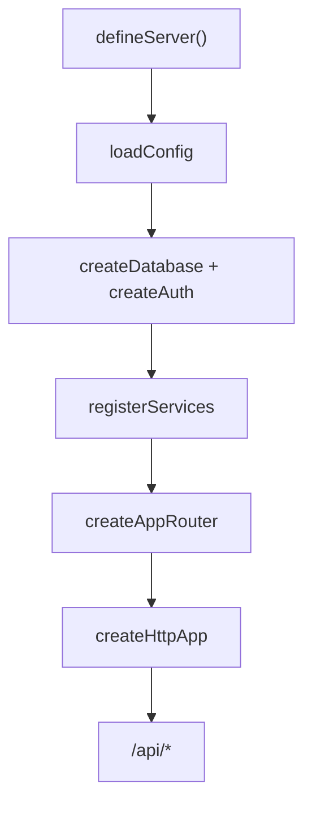

# Kiến trúc

## Monorepo

```text
app/api   ──depends──▶  @duneta/server
app/web   ──depends──▶  @duneta/client

app/web KHÔNG import @duneta/server
```

App shell mỏng — framework trong `packages/`, mở rộng qua config + hooks.

## Luồng boot API



### `defineServer` — hooks

| Hook | File | Việc |
|------|------|------|
| `config` | `duneta.config.ts` | Cấu hình app |
| `createAppRouter` | `routers/index.ts` | Ghép route groups |
| `registerServices` | `services/index.ts` | Đăng ký controller/repository |
| `resolvePermissions` | `permissions/index.ts` | Role → grants (optional) |

## Runtime

| Entry | Import | Target |
|-------|--------|--------|
| `server.ts` | `@duneta/server/runtime/worker` | `worker` |
| `server.node.ts` | `@duneta/server/runtime/node` | `node` |

## Dependency injection

| Container | Đăng ký qua |
|-----------|-------------|
| `ControllerContainer` | `registerServices` |
| `RepositoryContainer` | `registerServices` |

Infra (`db`, `auth`, `cache`) inject trực tiếp qua `attachRequestServices` — không qua DI container.

## Request context

| Key | Khi nào có |
|-----|------------|
| `db`, `auth`, `cache` | Khi feature bật |
| `controllers`, `repositories` | Luôn |
| `userId`, `session` | Sau `requireSession()` |
| `permissionCheck` | Sau `requireSession()` + `resolvePermissions` |

## Layer domain

```text
Route  →  Controller  →  Repository  →  Database
```

- **Route**: `defineGroup` + `resolveController('UserController', 'index')`
- **Protected route**: `requireSession()` middleware
- **Policy**: `UserPolicy.list(c)` trong controller

## Vocabulary

| Term | Nghĩa |
|------|--------|
| `registerServices` | Đăng ký DI (không phải OAuth providers) |
| `composeRouter` | Ghép `RouteGroup[]` → Hono (framework) |
| `createAppRouter` | App compose routes theo config |
| `resolveController` | Handler lấy controller từ container |
| `requireSession` | Login + load permission grants |
| `PlatformEnv` | Cloudflare Worker `env` |
| `ServerBoot` | Config đã normalize lúc boot |
